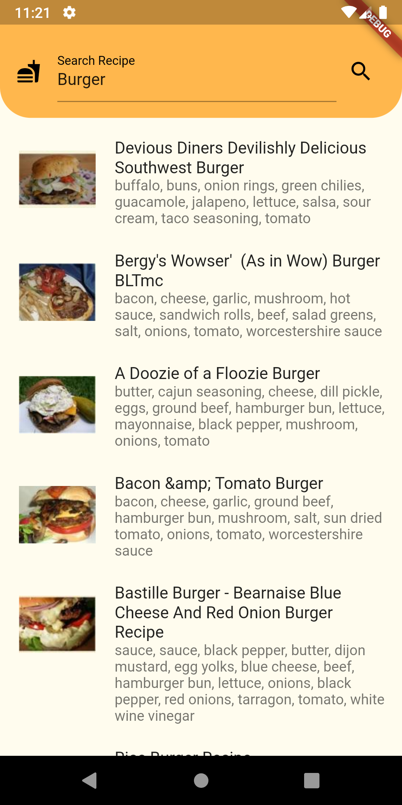
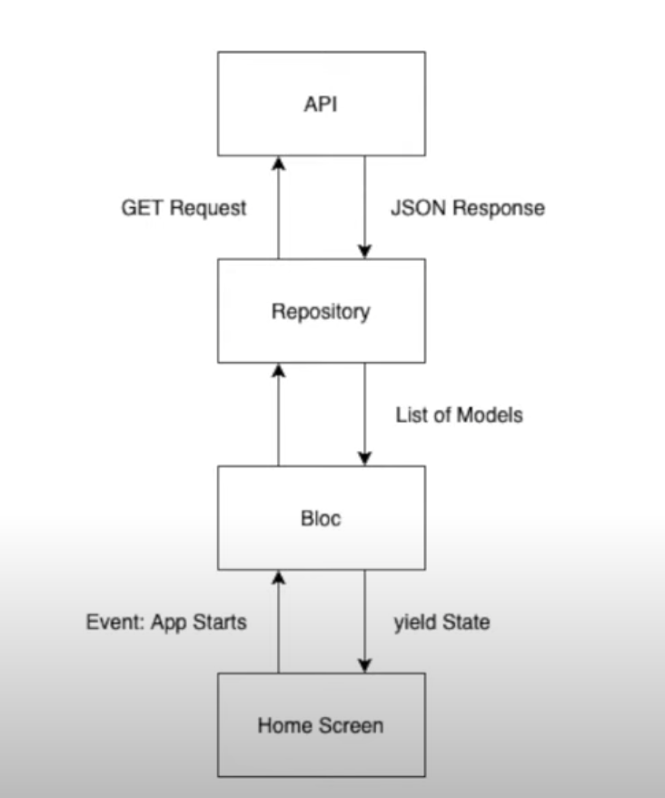
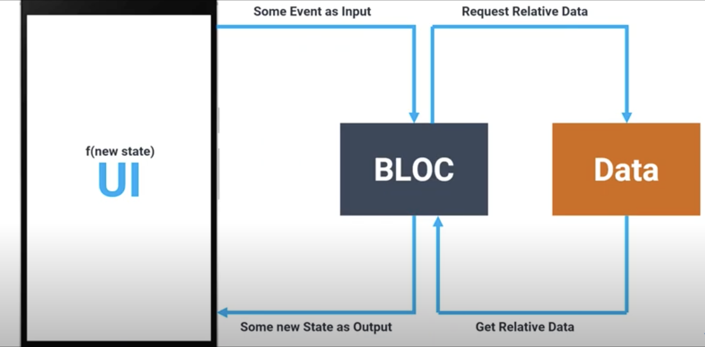
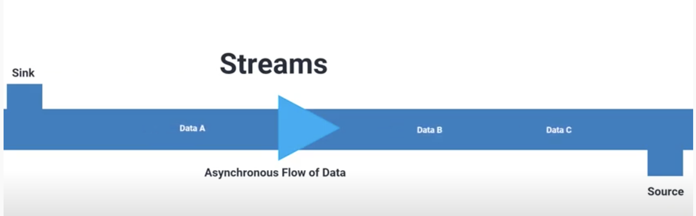

# flutter Recipe App

A Flutter application which demonstrate the BLoC pattern,\
 API calling,\
 Separating business logic from widget,\
 Writing clean code,\
 Unit testing,\
 and Infinite page scrolling (pagination) 

## App Screenshot

  

## App Architecture 

  

Repository is responsible to get the data either from API or local database\
BLoC stands for (Business logic component) which handle the business logic of app\
HomeScreen will render the UI to which user can interact

# Core Concepts BLoC

  

## Events
Events are the input to a Bloc. They are commonly added in response to user interactions such as button presses or lifecycle events like page loads.

## States
States are the output of a Bloc and represent a part of your application's state. UI components can be notified of states and redraw portions of themselves based on the current state.

## Transitions
The change from one state to another is called a Transition. A Transition consists of the current state, the event, and the next state

## Streams
A stream is a sequence of asynchronous data.\
In order to use Bloc, it is important to have a solid understanding of Streams and how they work.\
If you're unfamiliar with Streams just think of a pipe with water flowing through it. The pipe is the Stream and the water is the asynchronous data.

  

## Sink: 
Using sink we can add the data to steam. In code Bloc.add(EventName)
## Source: 
By using sorce we can Consume the data
